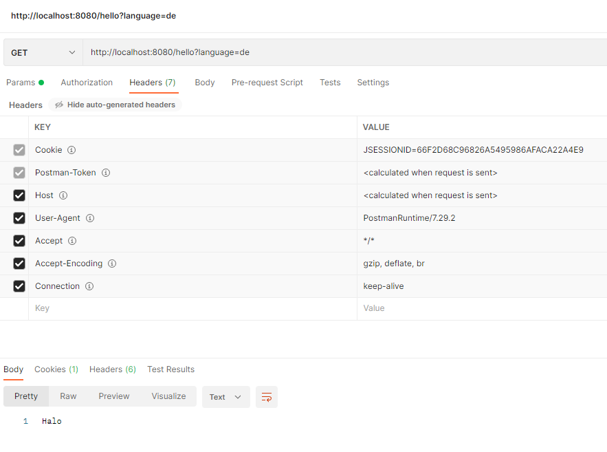
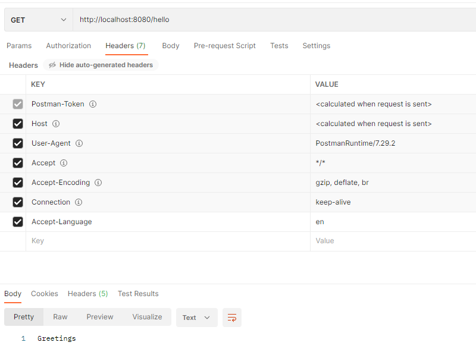
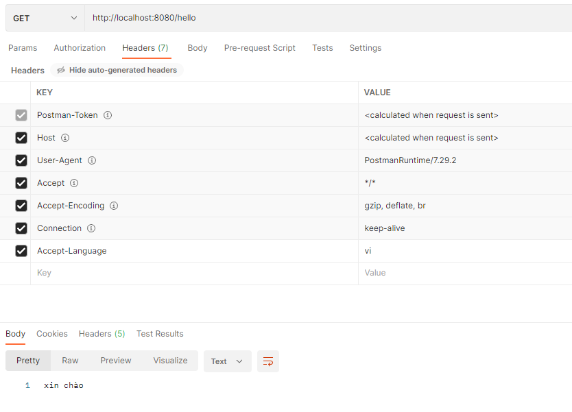

# I18n ( Internationalization ) with Spring Boot REST

The `MessageSource` will support to get content from `properties` file

## 2 way to config

```java
@Component
@RequiredArgsConstructor
public class MessageUtils {
    private final MessageSource messageSource;

    public String populate(String key) {
        return populate(key, null);
    }

    public String populate(String key, String[] params) {
        return messageSource.getMessage(key, params, LocaleContextHolder.getLocale());
    }
}
```

### 1. WAY 1: use language parameter to change language

```java
    @Bean
    public LocaleResolver localeResolver() {
        SessionLocaleResolver slr = new SessionLocaleResolver();
        slr.setDefaultLocale(Locale.US);
        return slr;
    }

    @Bean
    public LocaleChangeInterceptor localeChangeInterceptor() {
        LocaleChangeInterceptor localeChangeInterceptor = new LocaleChangeInterceptor();
        localeChangeInterceptor.setParamName("language");
        return localeChangeInterceptor;
    }
```

the request will be:

    GET http://localhost:8080/hello

    GET http://localhost:8080/bye

=> to change language:

    GET http://localhost:8080/hello?language=de

    GET http://localhost:8080/bye?language=us



### 2. add a list supported languages => use header `Accept-Language`
## => Prefer

```java
    @Bean
    public LocaleResolver localeResolver() {
        AcceptHeaderLocaleResolver acceptHeaderLocaleResolver = new AcceptHeaderLocaleResolver();
        Locale vietnamLocale = new Locale("vi", "VN");
        List<Locale> localeList = new ArrayList<>();
        localeList.add(Locale.ENGLISH);
        localeList.add(Locale.GERMAN);
        localeList.add(vietnamLocale);
        acceptHeaderLocaleResolver.setSupportedLocales(localeList);
        acceptHeaderLocaleResolver.setDefaultLocale(vietnamLocale);
//        acceptHeaderLocaleResolver.setDefaultLocale(Locale.ENGLISH);
        return acceptHeaderLocaleResolver;
    }

    @Bean
    public LocaleChangeInterceptor localeChangeInterceptor() {
        return new LocaleChangeInterceptor();
    }
```

the request will be:

    GET http://localhost:8080/hello
        Accept-Language=vi

    GET http://localhost:8080/bye
        Accept-Language=de

    GET http://localhost:8080/hello
        Accept-Language=en






